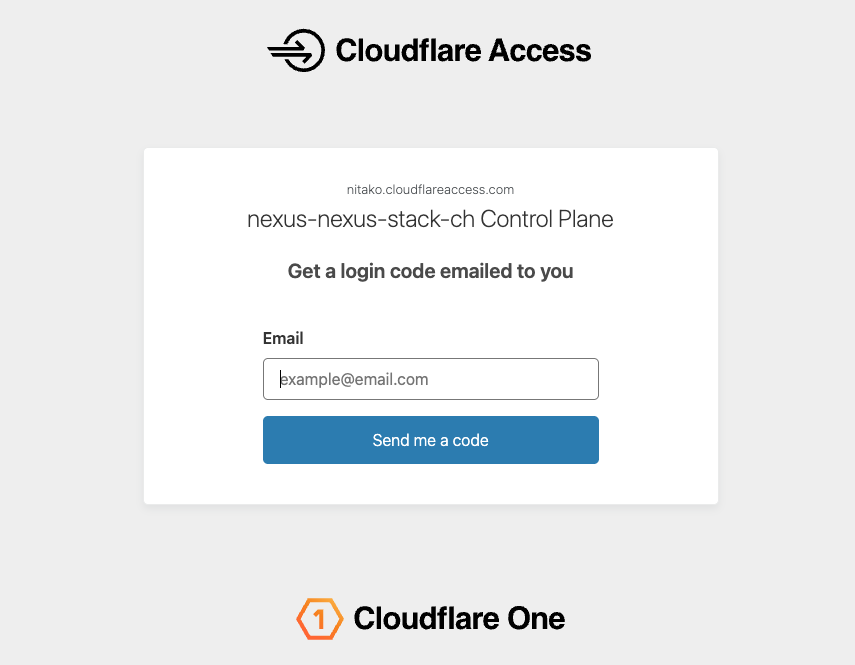
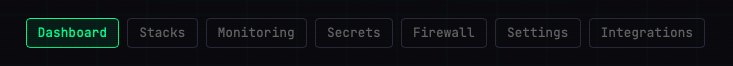

# Control Plane

The **Control Plane** is your web dashboard for managing a Nexus-Stack deployment: spin the stack up, tear it down, manage services, view secrets, and configure integrations — all behind Cloudflare Access authentication so only you (and anyone you've explicitly allow-listed) can reach it.

## Accessing the Control Plane

Your Control Plane lives at:

```
https://control.<your-domain>
```

For flat-subdomain deployments it's the dashed form:

```
https://control-<your-domain>
```

On first visit Cloudflare Access redirects you to an email-OTP challenge.



 Enter the email address the stack was deployed for, check your inbox, click the one-time code — and you're in. The session lasts 24 hours.

## Navigation

The top nav has seven sections:



| Page | What you do there |
|------|-------------------|
| [Dashboard](./dashboard.md) | See infrastructure status, spin up / tear down the stack |
| [Stacks](./stacks.md) | Enable, disable, and open individual Docker services |
| [Monitoring](./monitoring.md) | Inspect workflow logs, config, and runtime state |
| [Secrets](./secrets.md) | Read-only view of Infisical secrets |
| [Firewall](./firewall.md) | Open TCP ports for services that need direct access |
| [Settings](./settings.md) | Server info, teardown schedule, notifications |
| [Integrations](./integrations.md) | Databricks sync and other third-party hookups |

Each page is covered in its own short guide — linked above. Start with the [Dashboard](./dashboard.md) guide if you're brand new.
