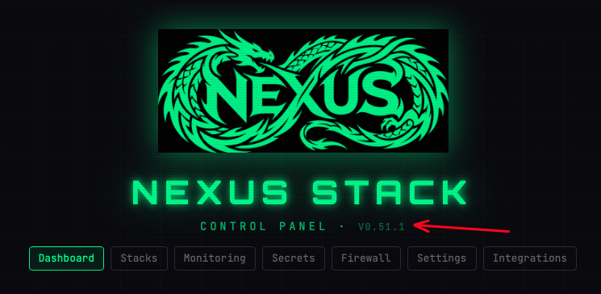
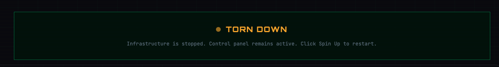
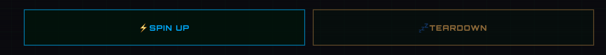
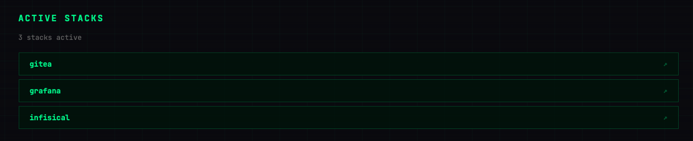

# Dashboard

The Dashboard is the landing page of the Control Plane. It answers two questions at a glance:

1. **Is my stack up right now?**
2. **What can I do about it?**

## Version tag

The header shows the currently-deployed Nexus-Stack template version (e.g. `v0.51.1`). If a newer release exists upstream you can upgrade from the admin panel (not from the Control Plane itself).

## Status panel

The coloured indicator at the top reflects the current state of your Hetzner infrastructure:

| Colour | Meaning |
|--------|---------|
| Green — **Deployed** | Server is running, Docker services are up, domain resolves |
| Amber — **Pending** | A workflow is in progress (spin-up, teardown, or initial setup) |
| Orange — **Torn down** | No server exists; nothing is running, nothing is being billed |
| Grey — **Unknown** | Status check failed; see [Monitoring](./monitoring.md) for details |

The panel re-polls automatically every few seconds, so you can keep it open while a workflow runs.

## Action buttons

Two buttons, each tied to a GitHub Actions workflow:

### ⚡ Spin Up

Starts `spin-up.yml` on your repo, which:
- Boots a Hetzner server
- Mounts the persistent volume
- Installs Docker + cloudflared
- Restarts all enabled services

Typical runtime: 3–5 minutes. Button stays disabled until the stack is fully torn down (can't spin up on top of a running server).

### 💤 Teardown

Starts `teardown.yml`, which:
- Stops and deletes the Hetzner server
- Detaches the volume (data preserved)
- Leaves DNS, tunnels, and Infisical in place so the next spin-up is fast

Cheap state: you pay only for the persistent volume (~€1/month).

## When buttons are disabled

The Control Plane will grey out actions that don't apply right now — e.g. **Spin Up** is disabled while the stack is already running or while a teardown is in flight. Hover the disabled button to see the reason.

## Active Stacks

Below the action buttons the Dashboard lists which services are currently active. Each row shows a service name that is enabled and running on the stack.

The count ("3 stacks active") reflects services enabled in [Stacks](./stacks.md). Click a service row to open the service directly in a new tab.
