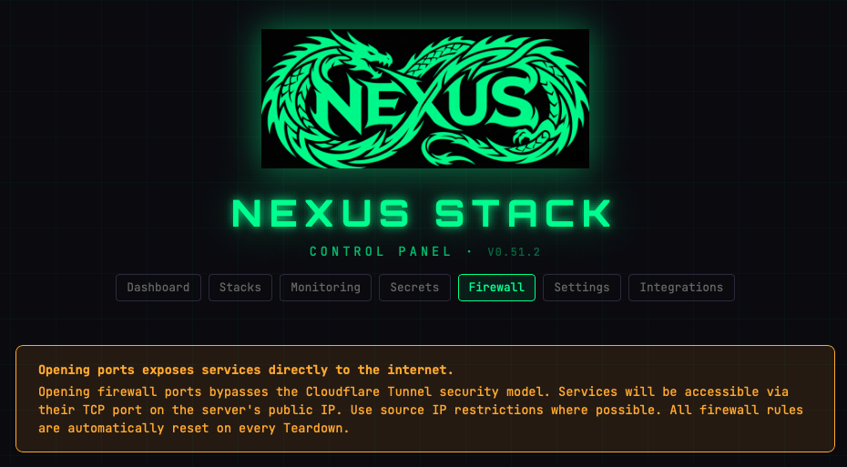
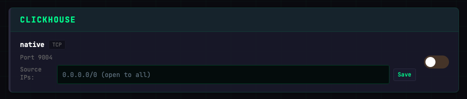
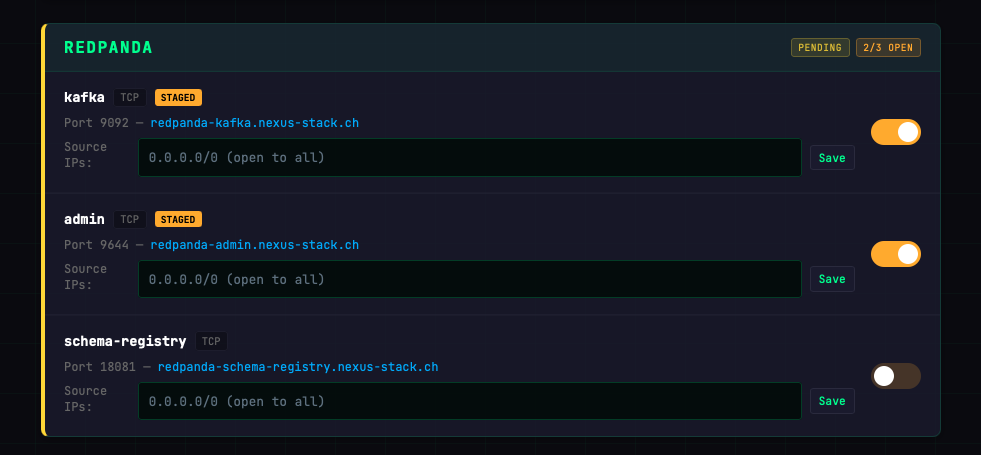
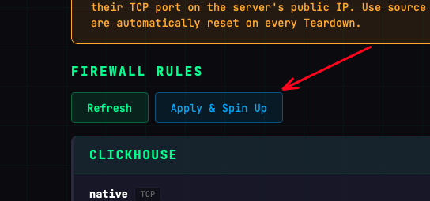

# Firewall

Most traffic reaches your stack through the **Cloudflare Tunnel**, which means zero open ports on the server itself. A few services — think a database client, a Kafka producer, or a Spark worker connecting over raw TCP — need direct port access. The Firewall page is where you allow that, carefully.

> **Warning:** Opening a port exposes a service directly to the internet, bypassing Cloudflare Access and the Tunnel security model. Use this only when there's no way to go through the tunnel, and always constrain the source IP range.

## Configuring a rule

Each enabled stack that exposes TCP ports appears as a card. Each port entry has:

- **Toggle** — Enable or disable that specific port. Disabling a port removes the rule.
- **Source IPs** — CIDR range of allowed sources. Use `0.0.0.0/0` only if you really mean "anyone on the internet". Prefer restricting to your own IP.
- **Save** — Stages the change (not yet live).

Services with multiple TCP ports (e.g. Redpanda with `kafka`, `admin`, and `schema-registry`) show each port as a separate entry in the same card. Enabled ports are marked **STAGED** until applied. The card header shows a **PENDING** badge with a count of how many ports are open (e.g. `2/3 OPEN`).

## Applying rules

Staged changes are not live until you click **Apply & Spin Up**. This triggers a GitHub Actions workflow that updates the Hetzner firewall and restarts the stack with the new rules.

Use **Refresh** to reload the current firewall state from the server.

## Rules reset on Teardown

Every Teardown resets all custom rules. This is a **safety feature**: if you forgot a wide-open port before tearing down, it won't silently re-appear on the next Spin Up. You have to re-add the rule deliberately.

## What's always allowed

- Outbound: all traffic (so the server can reach Docker Hub, Infisical, Cloudflare, etc.)
- Inbound: nothing, except what you add here

The Cloudflare Tunnel does not use inbound TCP — it's an outbound tunnel — so the tunnel keeps working even with zero rules.
