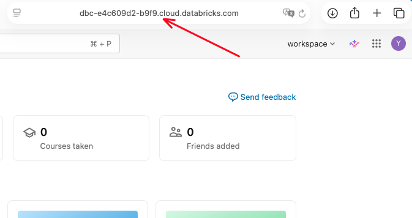
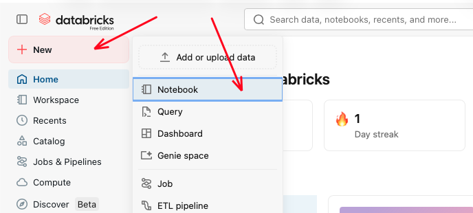

# Integrations

Integrations let your Nexus-Stack talk to platforms outside Hetzner. Today there's one first-class integration — **Databricks** — with more on the roadmap.


## Databricks

Mirrors your Infisical secrets into a Databricks workspace as secret scopes, so notebooks and jobs can read your stack's credentials without copy-pasting.

Don't have a Databricks account yet? [Register for free](https://login.databricks.com/signup).

### What gets synced

Currently only secrets are synced:

- **Secrets → Databricks secret scope.** Every Infisical secret is mirrored into a scope named `nexus`. The sync is triggered manually from the [Secrets page](./secrets.md) — click **Sync Now** whenever you want the scope to reflect the latest Infisical state.

### Key naming

Inside the `nexus` scope, every key is prefixed with its Infisical folder: `<folder>/<KEY>`. For example:

| Infisical location | Databricks scope key |
|---|---|
| folder `postgres`, key `POSTGRES_USERNAME` | `postgres/POSTGRES_USERNAME` |
| folder `redpanda`, key `REDPANDA_KAFKA_PUBLIC_URL` | `redpanda/REDPANDA_KAFKA_PUBLIC_URL` |
| folder `gitea`, key `GITEA_REPO_URL` | `gitea/GITEA_REPO_URL` |
| folder `r2-datalake`, keys `R2_ENDPOINT` / `R2_ACCESS_KEY` / `R2_SECRET_KEY` / `R2_BUCKET` | `r2-datalake/R2_ENDPOINT` etc. — see the [R2 data-lake tutorial](/docs/tutorials/databricks/r2-datalake/) |

This matches the folder view on the Control Plane's Secrets page exactly, so whatever you can see there is also what the sync pushes.

### Drift cleanup

Each sync run computes the diff between Infisical and the `nexus` scope and **deletes** any scope keys that are no longer present in Infisical. That keeps the scope tidy and — on first run after upgrading from 0.51.x or earlier — removes the legacy flat keys (`grafana_admin_password`, `admin_email`, …) that older versions wrote.

> **The `nexus` scope is a strict mirror.** Any key you add manually in Databricks under this scope that is not also in Infisical will be deleted on the next sync. Store unrelated Databricks-only secrets in a different scope; keep `nexus` reserved for the Infisical mirror.

Notebooks referencing the legacy flat names need to switch to the new `<folder>/<KEY>` convention.

### Finding your Workspace URL

Open your Databricks workspace in the browser. The URL in the address bar is your **Workspace URL** — copy everything up to `.cloud.databricks.com`.



### Creating a Personal Access Token (PAT)

Click your avatar (top right), then **Settings**.


In Settings, go to **Developer** → **Access tokens** → click **Manage**.


Click **Generate new token**.


Fill in the form:
- **Comment**: `Nexus-Stack` (or any label you recognise)
- **Lifetime**: 90 days (or longer)
- **Scope**: `Other APIs` → `all-apis`

Click **Generate**.


Copy the token immediately. You won't be able to see it again.


### Setup in the Control Plane

Go to **Integrations** in the Control Plane and fill in the two fields:

| Field | Value |
|-------|-------|
| **Workspace URL** | `https://dbc-xxxxx.cloud.databricks.com` |
| **Personal Access Token** | The token you just generated |


Click **Save Configuration**. The host and token are stored in Cloudflare KV; the token is never visible after saving.

To trigger the first sync, open the [Secrets page](./secrets.md) and click **Sync Now** in the Databricks panel. A toast reports how many secrets were upserted, how many stale keys were removed, and whether anything failed.

### Accessing Secrets in Databricks

Open a new Notebook in Databricks (**New → Notebook**).



List all available secret scopes — you should see `nexus`:

```python
dbutils.secrets.listScopes()
```


List all secrets in the `nexus` scope:

```python
dbutils.secrets.list("nexus")
```


Read a specific secret using the `<folder>/<KEY>` convention:

```python
admin_email = dbutils.secrets.get(scope="nexus", key="config/ADMIN_EMAIL")
print(admin_email)

# Service accounts, connection URLs, and everything else in Infisical
# is reachable the same way:
pg_user = dbutils.secrets.get(scope="nexus", key="postgres/POSTGRES_USERNAME")
kafka_url = dbutils.secrets.get(scope="nexus", key="redpanda/REDPANDA_KAFKA_PUBLIC_URL")
```

![Databricks notebook reading a secret with dbutils.secrets.get() and printing [REDACTED] as the value — the expected successful output](./assets/databricks-get-secret.png)

Secret values are always shown as `[REDACTED]` in Databricks notebook output — this is intentional and means the secret was read successfully.

### Reading the Nexus data lake from a notebook

The four keys under the `r2-datalake/` prefix — `R2_ENDPOINT`, `R2_ACCESS_KEY`, `R2_SECRET_KEY`, `R2_BUCKET` — give a Databricks notebook direct S3-compatible access to your Nexus R2 bucket. Parquet files written from Databricks are visible from Nexus-side tooling (via Infisical-stored credentials), and vice versa.

The full walkthrough lives in [Tutorials → Databricks → Read and write R2 from a notebook](/docs/tutorials/databricks/r2-datalake/) — PySpark `s3a://` configuration, `boto3` recipes, and the R2-specific quirks (`path.style.access=true`, `region=auto`). The bucket survives `destroy-all` on the Nexus side, so student work persists across stack resets.

## Future integrations

Planned: GitHub Codespaces bridge, JupyterHub SSO, Snowflake secret sync. Watch the [Nexus-Stack repo](https://github.com/stefanko-ch/Nexus-Stack) for new tiles on this page.
