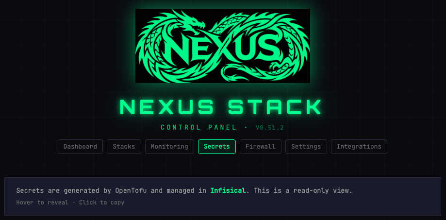
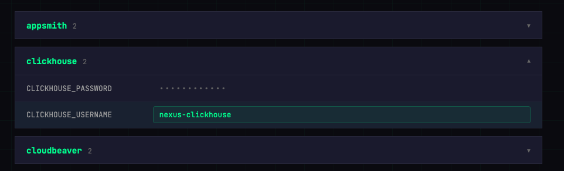

# Secrets

The Secrets page shows every secret managed by your stack, pulled live from **Infisical**. It's read-only by design — secrets are generated by OpenTofu during Spin Up and written to Infisical as the single source of truth. Editing them anywhere else would be overwritten on the next deploy.

## How it's organised

Secrets are grouped by service name (e.g. `clickhouse`, `appsmith`, `redpanda`). Click a folder row to expand it and reveal the keys it contains.

## Reading a secret

Values are hidden by default (shown as dots). Two ways to see them:

- **Hover** a row to reveal the value (auto-hides after a few seconds)
- **Click** a row to copy the value to the clipboard (you get a toast confirmation)

## Search

Type in the filter box at the top to match on key name or service. Useful when you know the name of a credential but not which service it belongs to.

## Editing secrets

You can't edit from the Control Plane. Two options:

1. **Rotate via re-deploy** — generated secrets (database passwords, admin tokens) rotate on the next Spin Up. Tear down, Spin Up, done.
2. **Direct in Infisical** — for user-added secrets (e.g. a third-party API key), log in to Infisical at `https://infisical.<your-domain>` with the credentials shown on the Control Plane Secrets page.

## Email Credentials

Click **Email Credentials** to receive a one-shot email with the generated admin passwords for all core services. Useful after a fresh deploy if you didn't get the initial credentials email or lost it.

Available only when the stack is deployed and Resend is configured.

## Sync to Databricks

Click **Sync Now** in the Databricks panel to mirror every secret on this page into the Databricks `nexus` secret scope. Keys are pushed with a folder prefix (e.g. `postgres/POSTGRES_USERNAME`) so notebooks can reach them via `dbutils.secrets.get(scope="nexus", key="postgres/POSTGRES_USERNAME")`.

The sync also removes any scope keys that are no longer in Infisical — that way the scope stays a clean mirror rather than accumulating stale entries.

> **The `nexus` scope is a strict mirror.** Keys you add manually in Databricks under this scope that are not also in Infisical will be deleted on the next sync. Keep unrelated Databricks-only secrets in a different scope.

The button is disabled until you've saved a Databricks workspace URL and token on the [Integrations page](./integrations.md). See [Integrations → Databricks](./integrations.md) for the full walkthrough.
